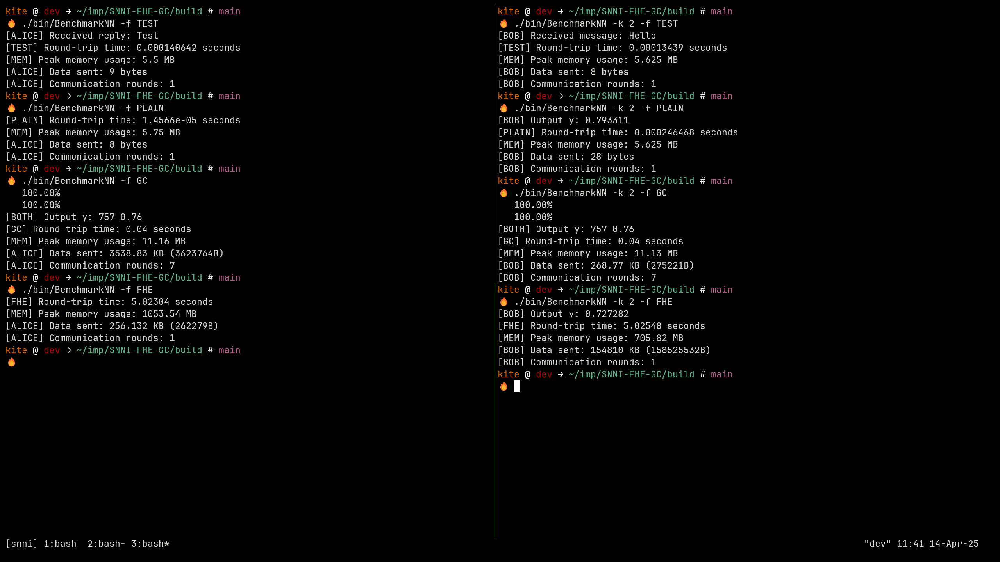

# SNNI-FHE-GC
## Description
Implementation of a Simple Neural Network Inference using Fully Homomorphic Encryption (CKKS Scheme from MS SEAL Library) and Garbled Circuits (Yao's GCs from TinyGarble2.0).

## 2-Layer NN Inference Function
```
y = sigmoid(w2*ReLU(w1*x+b1)+b2)
where as,
    y = inference result.
    1 hidden layer with size 4 (ReLU activation) and 1 output layer (sigmoid activation).
    weights and biases are as below,
    w1 = {
        {0.5, -0.2, 0.1},
        {-0.3, 0.8, -0.5},
        {0.7, 0.6, -0.1},
        {-0.4, 0.2, 0.9}
    };
    b1 = {0.1, -0.2, 0.05, 0.0};
    w2 = {0.6, -0.4, 0.9, -0.2};
    b2 = 0.1;
```
## Usage
This repository builds few binaries namely, PlainNN, SealNN, TinyNN, and BenchmarkNN. And their usage is as below.
```
# PlainNN and SealNN
cd build/
./bin/<binary-name>         # provide 3 inputs like 1 2 3.


# TinyNN
# Terminal 1 (Alice)
./bin/TinyNN -h
./bin/TinyNN

# Terminal 2 (Bob)
./bin/TinyNN -k 2    # provide 3 inputs when requested like 1 2 3.


# BenchmarkNN
# Program options ["TEST", "PLAIN", "FHE", "GC"]
# Terminal 1 (Alice)
./bin/BenchmarkNN -f <PROGRAM>

# Terminal 2 (Bob)
./bin/BenchmarkNN -f <PROGRAM> -k 2
```

## Results


## Setup (Ubuntu Noble 24.04.2 LTS)
1st, recursive clone this repository:

```
git clone --recursive https://github.com/kalyancheerla/SNNI-FHE-GC.git
```

2nd, install the dependencies:

```
sudo ./external/TinyGarble2.0/install_scripts/install_dependencies.sh
```

3rd, install emp-tool:

```
cd external  #since all external repos are present here.
cd emp-tool
cmake . -DCMAKE_INSTALL_PREFIX=../../third_party_install/
make -j
make install -j
cd ..
```

4th, install emp-ot:

```
cd emp-ot
cmake . -DCMAKE_INSTALL_PREFIX=../../third_party_install/
make -j
make install -j
cd ..
```

5th, install TinyGarble2.0:

```
cd TinyGarble2.0
cmake . -DCMAKE_INSTALL_PREFIX=../../third_party_install/
make -j
make install -j
cd ..
```
6th, install SEAL:
```
cd SEAL
cmake -S . -B build -DCMAKE_INSTALL_PREFIX=../../third_party_install/
cmake --build build
cmake --install build
cd ../..
```

Note: Specifying `-DCMAKE_INSTALL_PREFIX=../../third_party_install/` in the above instructions is necessary to change the install path to a local directory within the repository.

With this setup, we will have required header files, libraries, and cmake files populated in `third_party_install/` directory under `include/`, `lib/` and `cmake/`.

7th, building project:
```
cd build/
cmake ..
make -j
ls -la bin/
```

Finally you can find the binaries in the `bin/` directory.
